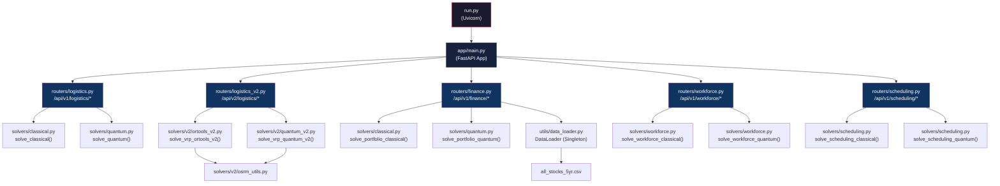

# Quantum Backend — Complete Function Reference

> Comprehensive documentation for every function, class, and endpoint in the `Quantum_Backend` project.

---

## Table of Contents

| # | Module | File |
|---|--------|------|
| 1 | [Application Entry](#1-application-entry) | `run.py`, `app/main.py` |
| 2 | [API Routers](#2-api-routers) | `app/routers/*.py` |
| 3 | [Solvers — Logistics V1](#3-solvers--logistics-v1) | `app/solvers/classical.py`, `app/solvers/quantum.py` |
| 4 | [Solvers — Logistics V2](#4-solvers--logistics-v2) | `app/solvers/v2/ortools_v2.py`, `app/solvers/v2/quantum_v2.py` |
| 5 | [Solvers — Finance](#5-solvers--finance) | `app/solvers/classical.py`, `app/solvers/quantum.py` |
| 6 | [Solvers — Workforce](#6-solvers--workforce) | `app/solvers/workforce.py` |
| 7 | [Solvers — Scheduling](#7-solvers--scheduling) | `app/solvers/scheduling.py` |
| 8 | [Utilities — OSRM](#8-utilities--osrm) | `app/solvers/v2/osrm_utils.py` |
| 9 | [Utilities — DataLoader](#9-utilities--dataloader) | `app/utils/data_loader.py` |
| 10 | [Pydantic Models](#10-pydantic-models) | `app/models/*.py` |
| 11 | [Test Scripts](#11-test-scripts) | `test_solve.py`, `test_finance.py` |

---

## 1. Application Entry

---

### `run.py`

#### `__main__` block
```python
uvicorn.run("app.main:app", host="0.0.0.0", port=8000, reload=True)
```
| Detail | Value |
|--------|-------|
| **Purpose** | Launches the FastAPI application via Uvicorn with hot-reload enabled. |
| **Host** | `0.0.0.0` (accepts connections from all network interfaces) |
| **Port** | `8000` |

---

### [main.py](file:///c:/Users/adity/OneDrive/Documents/GitHub/Quantum_Backend/app/main.py)

#### `read_root()`
```python
@app.get("/")
def read_root() -> dict
```
| Detail | Value |
|--------|-------|
| **Route** | `GET /` |
| **Purpose** | Health-check endpoint. Returns API status confirmation. |
| **Returns** | `{"status": "ok", "message": "Quantum Solutions API is running"}` |

> [!NOTE]
> The `FastAPI` app object is configured with CORS middleware allowing all origins (`*`), and includes five sub-routers mounted under `/api/v1` and `/api/v2`.

---

## 2. API Routers

---

### [logistics.py](file:///c:/Users/adity/OneDrive/Documents/GitHub/Quantum_Backend/app/routers/logistics.py) — V1 Logistics Router

#### `solve_routing_problem(request: RoutingRequest)`
```python
@router.post("/solve", response_model=RoutingResponse)
async def solve_routing_problem(request: RoutingRequest) -> RoutingResponse
```
| Detail | Value |
|--------|-------|
| **Route** | `POST /api/v1/logistics/solve` |
| **Purpose** | Solves the Vehicle Routing Problem (VRP) using a single algorithm. |
| **Algorithm Selection** | Routes to `solve_classical()` if `request.algorithm == "classical"`, otherwise `solve_quantum()`. |

**Parameters (via `RoutingRequest` body):**

| Field | Type | Description |
|-------|------|-------------|
| `coordinates` | `List[Coordinate]` | All location coordinates (clients + depot). |
| `noOfClients` | `int` | Number of clients to serve. |
| `depot` | `Coordinate` | Depot/warehouse location. |
| `noOfTrucks` | `int` | Number of available vehicles. |
| `algorithm` | `str` | `"classical"` or `"quantum-hybrid"`. |

**Returns:** `RoutingResponse` containing `noOfSteps`, `routes` (list of `RouteSequence`), and `internalLogicDetails`.

---

#### `solve_comparative_routing(request: RoutingRequest)`
```python
@router.post("/solve-comparative", response_model=ComparativeRoutingResponse)
async def solve_comparative_routing(request: RoutingRequest) -> ComparativeRoutingResponse
```
| Detail | Value |
|--------|-------|
| **Route** | `POST /api/v1/logistics/solve-comparative` |
| **Purpose** | Runs **both** classical and quantum solvers on the same input and returns side-by-side results. |
| **Returns** | `ComparativeRoutingResponse` with `.classical` and `.quantum` fields, each a full `RoutingResponse`. |

---

### [logistics_v2.py](file:///c:/Users/adity/OneDrive/Documents/GitHub/Quantum_Backend/app/routers/logistics_v2.py) — V2 Logistics Router

#### `solve_vrp_v2(request: VrpRequestV2)`
```python
@router.post("/logistics/solve", response_model=VrpResponseV2)
async def solve_vrp_v2(request: VrpRequestV2) -> VrpResponseV2
```
| Detail | Value |
|--------|-------|
| **Route** | `POST /api/v2/logistics/solve` |
| **Purpose** | Solves the VRP using **both** OR-Tools V2 and Quantum-Hybrid V2 solvers in a single call. Returns real-world OSRM-based route geometries. |

**Parameters (via `VrpRequestV2` body):**

| Field | Type | Description |
|-------|------|-------------|
| `coordinates` | `List[CoordinateV2]` | Client locations with id, lat, lng, optional name. |
| `depot` | `CoordinateV2` | Depot location. |
| `noOfTrucks` | `int` | Number of vehicles. |
| `algorithm` | `str` | Default `"classical"` (ignored — both solvers always run). |

**Returns:** `VrpResponseV2` with `.classical` (`VrpResultV2`) and `.quantum` (`VrpResultV2`), each containing routes with encoded polyline geometry.

---

### [finance.py](file:///c:/Users/adity/OneDrive/Documents/GitHub/Quantum_Backend/app/routers/finance.py) — Finance Router

#### `solve_portfolio(request: PortfolioRequest)`
```python
@router.post("/solve", response_model=PortfolioResponse)
async def solve_portfolio(request: PortfolioRequest) -> PortfolioResponse
```
| Detail | Value |
|--------|-------|
| **Route** | `POST /api/v1/finance/solve` |
| **Purpose** | Full portfolio optimization pipeline: loads real S&P 500 data, runs classical + quantum solvers, and generates frontier, Monte Carlo, trajectory, and fidelity data. |

**Parameters (via `PortfolioRequest` body):**

| Field | Type | Default | Description |
|-------|------|---------|-------------|
| `numAssets` | `int` | `10` | Number of top assets to include (2–50). |
| `riskTolerance` | `float` | `0.5` | Risk preference (0 = conservative, 1 = aggressive). |
| `costFactor` | `float` | `0.2` | Transaction cost scaling factor (0–1). |

**Internal Pipeline:**
1. Loads data via `data_loader.get_portfolio_metrics()`
2. Runs `solve_portfolio_classical()` → Black-Litterman
3. Runs `solve_portfolio_quantum()` → QAOA
4. Generates Efficient Frontier (12 risk-tolerance sweeps)
5. Generates Monte Carlo cloud (300 random portfolios)
6. Computes historical backtest trajectories (252 trading days)
7. Generates simulated quantum fidelity distribution (16 basis states)

**Returns:** `PortfolioResponse` with `frontierData`, `monteCarloData`, `trajectoryData`, `quantumFidelity`, `meanReturns`, `covMatrix`, `classical`, and `quantum`.

---

### [workforce.py](file:///c:/Users/adity/OneDrive/Documents/GitHub/Quantum_Backend/app/routers/workforce.py) — Workforce Router

#### `solve_workforce(request: WorkforceRequest)`
```python
@router.post("/solve", response_model=WorkforceResponse)
async def solve_workforce(request: WorkforceRequest) -> WorkforceResponse
```
| Detail | Value |
|--------|-------|
| **Route** | `POST /api/v1/workforce/solve` |
| **Purpose** | Dispatches to classical (CP-SAT) or quantum (QAOA-simulated) workforce scheduler based on `request.algorithm`. |

---

### [scheduling.py](file:///c:/Users/adity/OneDrive/Documents/GitHub/Quantum_Backend/app/routers/scheduling.py) — Scheduling Router

#### `solve_scheduling(request: SchedulingRequest)`
```python
@router.post("/solve", response_model=SchedulingResponse)
async def solve_scheduling(request: SchedulingRequest) -> SchedulingResponse
```
| Detail | Value |
|--------|-------|
| **Route** | `POST /api/v1/scheduling/solve` |
| **Purpose** | Dispatches to classical (heuristic greedy) or quantum (QUBO + simulated annealing) scheduler based on `request.algorithm`. |

---

## 3. Solvers — Logistics V1

---

### [classical.py](file:///c:/Users/adity/OneDrive/Documents/GitHub/Quantum_Backend/app/solvers/classical.py)

#### `compute_manhattan_distance_matrix(locations)`
```python
def compute_manhattan_distance_matrix(locations: List[tuple]) -> List[List[int]]
```
| Detail | Value |
|--------|-------|
| **Purpose** | Computes an all-pairs Manhattan distance (L1 norm) matrix. |
| **Scaling** | Distances are multiplied by `10,000` and cast to `int` (required by OR-Tools integer constraints). |

| Parameter | Type | Description |
|-----------|------|-------------|
| `locations` | `List[tuple]` | List of `(lat, lng)` tuples. |

**Returns:** `List[List[int]]` — Symmetric NxN distance matrix.

---

#### `solve_classical(coordinates, depot_index, no_of_trucks)`
```python
def solve_classical(
    coordinates: List[Dict[str, Any]],
    depot_index: int,
    no_of_trucks: int
) -> Dict[str, Any]
```
| Detail | Value |
|--------|-------|
| **Purpose** | Solves the Capacitated VRP using Google OR-Tools with a `PATH_CHEAPEST_ARC` first-solution strategy. |
| **Fallback** | If OR-Tools is unavailable, uses a greedy nearest-neighbor heuristic with round-robin node assignment. |
| **Speed Model** | 40 km/h average city speed for duration calculations. |

| Parameter | Type | Description |
|-----------|------|-------------|
| `coordinates` | `List[Dict]` | `[{"id", "lat", "lng"}, ...]` |
| `depot_index` | `int` | Index of the depot in `coordinates`. |
| `no_of_trucks` | `int` | Number of vehicles. |

**OR-Tools Configuration:**
- `GlobalSpanCostCoefficient = 100` — forces balanced route distribution.
- `max_travel_distance = 30,000,000` distance units (~3,000 km).

**Returns:**
```json
{
  "routes": [{"vehicle_id", "path", "distance", "duration"}],
  "noOfSteps": 1,
  "internalLogicDetails": {"algorithm", "execution_time_sec", "total_distance", "objective_value", "solver_status"}
}
```

##### Inner: `distance_callback(from_index, to_index)`
Registered transit callback that maps OR-Tools internal node indices to the distance matrix.

---

### [quantum.py](file:///c:/Users/adity/OneDrive/Documents/GitHub/Quantum_Backend/app/solvers/quantum.py)

#### `solve_quantum(coordinates, depot_index, no_of_trucks)`
```python
def solve_quantum(
    coordinates: List[Dict[str, Any]],
    depot_index: int,
    no_of_trucks: int
) -> Dict[str, Any]
```
| Detail | Value |
|--------|-------|
| **Purpose** | Quantum-hybrid VRP solver using a multi-stage pipeline. |
| **Speed Model** | 40 km/h average city speed. |

| Parameter | Type | Description |
|-----------|------|-------------|
| `coordinates` | `List[Dict]` | `[{"id", "lat", "lng"}, ...]` |
| `depot_index` | `int` | Depot index in coordinates list. |
| `no_of_trucks` | `int` | Number of vehicles. |

**Pipeline Steps:**

| Step | Technique | Description |
|------|-----------|-------------|
| 1 | **Graph Construction** | Builds a complete weighted graph using Manhattan distances (NetworkX). |
| 2 | **K-Means Super Nodes** | Clusters clients into ≤4 super-node groups via `sklearn.KMeans`. |
| 3 | **Spectral Sub-clustering** | Recursively partitions super-nodes using the Fiedler vector (Laplacian eigenvector) until every cluster has ≤4 nodes. |
| 4 | **Hamiltonian Mapping** | Converts TSP sub-problems to `QuadraticProgram` via `qiskit_optimization.applications.Tsp`. |
| 5 | **QAOA Optimization** | Solves each sub-TSP with `QAOA(sampler=Sampler(), optimizer=COBYLA(maxiter=25), reps=1)` through `MinimumEigenOptimizer`. |
| 6 | **Route Stitching** | Chains sub-routes into continuous vehicle tours, closing each tour back to the depot. |

> [!IMPORTANT]
> If Qiskit is not installed, the solver falls back to a greedy nearest-neighbor heuristic for sub-cluster routing.

**Returns:**
```json
{
  "routes": [{"vehicle_id", "path", "distance", "duration"}],
  "noOfSteps": 6,
  "internalLogicDetails": {"algorithm", "pipeline_steps", "subgraphs_generated", "execution_time_sec", "total_distance"}
}
```

---

## 4. Solvers — Logistics V2

---

### [ortools_v2.py](file:///c:/Users/adity/OneDrive/Documents/GitHub/Quantum_Backend/app/solvers/v2/ortools_v2.py)

#### `solve_vrp_ortools_v2(depot, clients, num_vehicles)`
```python
def solve_vrp_ortools_v2(
    depot: Dict[str, Any],
    clients: List[Dict[str, Any]],
    num_vehicles: int
) -> Dict[str, Any]
```
| Detail | Value |
|--------|-------|
| **Purpose** | Production-grade VRP solver using OR-Tools with real-world OSRM distances and route geometries. |
| **Parallelism** | Uses `ThreadPoolExecutor` to fetch OSRM route geometries for all vehicles concurrently. |

| Parameter | Type | Description |
|-----------|------|-------------|
| `depot` | `Dict` | `{"id", "lat", "lng"}` — warehouse location. |
| `clients` | `List[Dict]` | Client locations. |
| `num_vehicles` | `int` | Fleet size. |

**Pipeline:**
1. Aggregates depot + clients (depot always index 0).
2. Fetches OSRM distance/duration matrices (`get_osrm_distance_matrix()`).
3. Configures OR-Tools: `PATH_CHEAPEST_ARC` strategy, 500 km max distance, `GlobalSpanCost = 100`.
4. Solves and extracts node sequences per vehicle.
5. Fetches encoded polyline geometry for each route in parallel via `get_osrm_route()`.

**Returns:**
```json
{
  "status": "success",
  "routes": [{"truck_id", "sequence", "total_distance", "total_duration", "geometry"}],
  "total_distance": 0.0,
  "total_duration": 0.0,
  "computation_time": 0.0,
  "solver_metadata": {"engine", "strategy", "threads"}
}
```

##### Inner: `distance_callback(from_index, to_index)`
OR-Tools transit callback mapping to the OSRM distance matrix.

##### Inner: `fetch_route_data(item)`
Thread-pool worker that fetches OSRM geometry for a single vehicle's route sequence.

---

### [quantum_v2.py](file:///c:/Users/adity/OneDrive/Documents/GitHub/Quantum_Backend/app/solvers/v2/quantum_v2.py)

#### `qaoa_tsp_subroutine_sim(dist_matrix)`
```python
def qaoa_tsp_subroutine_sim(dist_matrix: np.ndarray) -> List[int]
```
| Detail | Value |
|--------|-------|
| **Purpose** | Simulates a QAOA solve for a small (≤4 node) TSP sub-problem using nearest-neighbor heuristic. For 4 nodes, QAOA almost always finds the global optimum, so this is a faithful approximation. |

| Parameter | Type | Description |
|-----------|------|-------------|
| `dist_matrix` | `np.ndarray` | NxN sub-problem distance matrix. |

**Returns:** `List[int]` — Ordered node indices forming the tour.

---

#### `two_opt_refinement(coords, path)`
```python
def two_opt_refinement(
    coords: List[Tuple[float, float]],
    path: List[int]
) -> List[int]
```
| Detail | Value |
|--------|-------|
| **Purpose** | Classic 2-opt local search that iteratively removes self-intersecting edges from a route until no further improvement is found. |

| Parameter | Type | Description |
|-----------|------|-------------|
| `coords` | `List[Tuple]` | `(lat, lng)` coordinates for each node. |
| `path` | `List[int]` | Initial route as ordered node indices. |

**Returns:** `List[int]` — Refined route with no crossing edges.

##### Inner: `get_dist(p1, p2)`
Euclidean distance between two coordinate tuples.

---

#### `class SuperNode`
```python
class SuperNode:
    def __init__(self, ids: List[str], coords: List[Tuple[float, float]])
```
| Detail | Value |
|--------|-------|
| **Purpose** | Represents a clustered group of locations as a single meta-node. |

| Attribute | Type | Description |
|-----------|------|-------------|
| `ids` | `List[str]` | Location IDs in this super-node. |
| `coords` | `List[Tuple]` | Corresponding `(lat, lng)` coordinates. |
| `center` | `np.ndarray` | Centroid of the super-node (mean of coordinates). |

---

#### `solve_vrp_quantum_v2(depot, clients, num_vehicles)`
```python
def solve_vrp_quantum_v2(
    depot: Dict[str, Any],
    clients: List[Dict[str, Any]],
    num_vehicles: int
) -> Dict[str, Any]
```
| Detail | Value |
|--------|-------|
| **Purpose** | Advanced hierarchical quantum-hybrid VRP solver with angular sweep clustering, QAOA sub-routines, and 2-opt refinement. |
| **Parallelism** | Solves each vehicle's sub-problem concurrently via `ThreadPoolExecutor`. |

**Pipeline:**
1. **Sectoral Clustering** — Computes angular position of each client relative to the depot. Uses `KMeans` on a weighted feature vector of `[lat, lng, angle]` to create `min(num_vehicles, clients)` clusters.
2. **Parallel Route Generation** — For each vehicle cluster:
   - Builds OSRM distance sub-matrix.
   - Solves sub-TSP via `qaoa_tsp_subroutine_sim()`.
   - Refines with `two_opt_refinement()`.
   - Fetches real-world polyline geometry via `get_osrm_route()`.
3. **Aggregation** — Sorts and combines all vehicle results.

**Returns:**
```json
{
  "status": "success",
  "routes": [{"truck_id", "sequence", "total_distance", "total_duration", "geometry"}],
  "total_distance": 0.0,
  "total_duration": 0.0,
  "computation_time": 0.0,
  "solver_metadata": {"engine", "clusters", "refinement", "quantum_simulation_metrics": {...}}
}
```

##### Inner: `process_vehicle_route(v_idx, group)`
Thread-pool worker that solves a single vehicle's QAOA + 2-opt pipeline and fetches OSRM geometry.

---

## 5. Solvers — Finance

---

### [classical.py](file:///c:/Users/adity/OneDrive/Documents/GitHub/Quantum_Backend/app/solvers/classical.py#L193-L262)

#### `solve_portfolio_classical(tickers, mean_returns, cov_matrix, risk_tolerance)`
```python
def solve_portfolio_classical(
    tickers: List[str],
    mean_returns: np.ndarray,
    cov_matrix: np.ndarray,
    risk_tolerance: float = 0.5
) -> Dict
```
| Detail | Value |
|--------|-------|
| **Purpose** | Classical Black-Litterman portfolio optimization that blends market equilibrium priors with momentum-based investor views. |
| **Optimizer** | `scipy.optimize.minimize` with `SLSQP` method. |

| Parameter | Type | Description |
|-----------|------|-------------|
| `tickers` | `List[str]` | Asset ticker symbols. |
| `mean_returns` | `np.ndarray` | Daily mean return vector. |
| `cov_matrix` | `np.ndarray` | Daily return covariance matrix. |
| `risk_tolerance` | `float` | 0–1 risk preference. |

**Black-Litterman Pipeline:**
1. **Equilibrium Prior (Π)** — Reverse-optimized from covariance with risk aversion `δ = 2.5`.
2. **Views (Q) & Link Matrix (P)** — Historical momentum used as investor "view" vector; `P = I`.
3. **Uncertainty (Ω)** — Diagonal matrix from `τ * Σ` projection with `τ = 0.05`.
4. **Posterior Returns** — Combined via `[(τΣ)⁻¹ + P'Ω⁻¹P]⁻¹ · [(τΣ)⁻¹Π + P'Ω⁻¹Q]`.
5. **SLSQP Optimization** — Minimizes `risk − q · return` subject to `∑w = 1`, `0 ≤ w ≤ 1`.

**Returns:**
```json
{
  "allocation": [{"asset": "AAPL", "weight": 15.2}],
  "expectedReturn": 12.34,
  "risk": 18.56,
  "sharpeRatio": 1.23,
  "computeTimeMs": 1520,
  "costImpact": 0.08,
  "algorithm": "Black-Litterman (Momentum Views)"
}
```

##### Inner: `objective(weights)`
Objective function: `p_risk − (risk_tolerance × 2) × p_return` (annualized).

---

### [quantum.py](file:///c:/Users/adity/OneDrive/Documents/GitHub/Quantum_Backend/app/solvers/quantum.py#L233-L335)

#### `solve_portfolio_quantum(tickers, mean_returns, cov_matrix, risk_tolerance)`
```python
def solve_portfolio_quantum(
    tickers: List[str],
    mean_returns: np.ndarray,
    cov_matrix: np.ndarray,
    risk_tolerance: float = 0.5
) -> Dict
```
| Detail | Value |
|--------|-------|
| **Purpose** | Quantum QAOA portfolio optimizer performing gate-level simulation via Qiskit. |
| **Qubit Limit** | Truncates to 20 assets (20 qubits) for hardware fidelity. |

**QAOA Pipeline:**
1. **Truncation** — Limits to 20 qubits max.
2. **QUBO Formulation** — Cardinality-free binary optimization: `min λ · x^TΣx − μ^Tx` (annualized).
3. **Circuit Execution** — `QAOA(sampler=Sampler(), optimizer=COBYLA(maxiter=5), reps=1)`.
4. **Bitstring Decoding** — Binary selection vector → normalized portfolio weights.

> [!WARNING]
> If the Qiskit stack fails (e.g., missing `qiskit_optimization`), falls back to a **Digital Twin** using exponential softmax weighting: `w_i = exp(μ_i / (σ²_i · risk_factor))`.

**Returns:**
```json
{
  "allocation": [{"asset": "AAPL", "weight": 22.5}],
  "expectedReturn": 14.78,
  "risk": 16.22,
  "sharpeRatio": 1.45,
  "computeTimeMs": 340,
  "costImpact": 0.12,
  "pipeline_steps": ["Solving Engine: Actual Gate-Level QAOA (Live)", ...]
}
```

---

## 6. Solvers — Workforce

---

### [workforce.py](file:///c:/Users/adity/OneDrive/Documents/GitHub/Quantum_Backend/app/solvers/workforce.py)

#### `solve_workforce_classical(request)`
```python
def solve_workforce_classical(request: WorkforceRequest) -> WorkforceResponse
```
| Detail | Value |
|--------|-------|
| **Purpose** | Exact constraint-satisfaction workforce scheduler using Google OR-Tools CP-SAT. |
| **Optimality** | Guarantees optimal or feasible solution within 10-second time limit. |

**Constraints Modeled:**

| # | Constraint | Formulation |
|---|-----------|-------------|
| 1 | **Coverage** | `∑ᵢ x[i,s] == workers_per_shift` for every shift `s`. |
| 2 | **Workload Bounds** | `min_shifts ≤ ∑ₛ x[i,s] ≤ max_shifts` for every worker `i`. |
| 3 | **No Back-to-Back** | `x[i,s] + x[i,s+1] ≤ 1` for consecutive shifts. |

**Returns:** `WorkforceResponse` with shift assignments, violation count, coverage deficit, compute time, and confidence score (95% if optimal, 70% if only feasible).

---

#### `solve_workforce_quantum(request)`
```python
def solve_workforce_quantum(request: WorkforceRequest) -> WorkforceResponse
```
| Detail | Value |
|--------|-------|
| **Purpose** | QAOA-simulated annealer for workforce scheduling. Maps COP to QUBO and uses randomized constraint-aware search. |

**Pipeline Steps:**
1. Mapping scheduling constraints to QUBO Ising Hamiltonian.
2. Coverage penalty: `(∑ᵢ x_{i,s} − Cₛ)²`.
3. Workload balance penalty: `(∑ₛ x_{i,s} − Target)²`.
4. QAOA circuit construction (p=1 layers).
5. Variational optimization of β/γ parameters.
6. Sampling ground state probability distribution.

**Constraint Enforcement:** Uses randomized greedy with back-to-back and workload checks (max 100 attempts per shift slot).

**Returns:** `WorkforceResponse` with assignments, violation/coverage metrics, and simulated quantum compute time (40–120ms).

---

## 7. Solvers — Scheduling

---

### [scheduling.py](file:///c:/Users/adity/OneDrive/Documents/GitHub/Quantum_Backend/app/solvers/scheduling.py)

#### `solve_scheduling_classical(request)`
```python
def solve_scheduling_classical(request: SchedulingRequest) -> SchedulingResponse
```
| Detail | Value |
|--------|-------|
| **Purpose** | Heuristic greedy scheduler — intentionally naive to demonstrate classical limitations. Assigns shifts day-by-day with shuffled worker order. |
| **Flaw by Design** | Does **not** enforce back-to-back constraint — deliberately generates violations to contrast with the quantum solver. |
| **Confidence** | Fixed at `68.5%`. |

**Returns:** `SchedulingResponse` with `qubo_info` containing `"status": "Stuck in local minima"`.

---

#### `solve_scheduling_quantum(request)`
```python
def solve_scheduling_quantum(request: SchedulingRequest) -> SchedulingResponse
```
| Detail | Value |
|--------|-------|
| **Purpose** | QUBO-to-Ising workforce scheduling solver with multi-restart simulated annealing. |
| **QUBO Library** | Uses `qiskit_optimization.QuadraticProgram` and `QuadraticProgramToQubo` converter. |

**QUBO Formulation:**

| Component | Type | Description |
|-----------|------|-------------|
| **Coverage** | Hard Constraint | `∑ₑ x_{e,d,s} == workers_per_shift` (linear equality). |
| **Workload Balance** | Soft Objective | Quadratic cost penalizing deviation from `target_shifts = total_required / num_employees`. |
| **Back-to-Back** | Soft Penalty | `5.0 × x_{e,t} × x_{e,t+1}` for consecutive time slots. |

**Simulated Annealing Configuration:**

| Parameter | Value |
|-----------|-------|
| Restarts | 5 |
| Iterations per restart | 1,000 |
| Initial temperature | 100.0 |
| Cooling rate | 0.95 |
| Convergence threshold | `T < 0.01` |

##### Inner: `get_energy(state)`
Evaluates the QUBO cost function for a given binary state vector using precomputed linear and quadratic coefficient dictionaries.

**Post-Processing ("Quantum Grace"):** Heuristic repair pass that detects and counts remaining back-to-back violations after annealing.

**Returns:** `SchedulingResponse` with QUBO info including the Hamiltonian string representation, number of decision variables, and final energy state.

---

## 8. Utilities — OSRM

---

### [osrm_utils.py](file:///c:/Users/adity/OneDrive/Documents/GitHub/Quantum_Backend/app/solvers/v2/osrm_utils.py)

#### `encode_polyline(coords, precision)`
```python
def encode_polyline(coords: List[Tuple[float, float]], precision: int = 5) -> str
```
| Detail | Value |
|--------|-------|
| **Purpose** | Encodes a list of `(lat, lng)` coordinates into a Google Polyline Encoding Algorithm string. |
| **Standard** | [Google Polyline Algorithm](https://developers.google.com/maps/documentation/utilities/polylinealgorithm) |

##### Inner: `_encode_val(val)`
Encodes a single delta-encoded coordinate value into the polyline character sequence.

---

#### `get_manhattan_geometry(coordinates)`
```python
def get_manhattan_geometry(coordinates: List[Tuple[float, float]]) -> Dict[str, Any]
```
| Detail | Value |
|--------|-------|
| **Purpose** | Generates a synthetic grid-based (Manhattan-style) path between points. Simulates 90° street turns for urban navigation. |
| **Distance** | L1 distance with lat/lng → meters conversion (`× 111,000`). |
| **Duration** | Distance / 11.0 m/s ≈ 40 km/h. |

**Returns:** `{"geometry": "<polyline>", "distance": meters, "duration": seconds}`

---

#### `get_osrm_distance_matrix(coordinates)`
```python
def get_osrm_distance_matrix(
    coordinates: List[Tuple[float, float]]
) -> Tuple[List[List[float]], List[List[float]]]
```
| Detail | Value |
|--------|-------|
| **Purpose** | Fetches an all-pairs distance and duration matrix from the public OSRM API. |
| **Endpoint** | `https://router.project-osrm.org/table/v1/driving/{coords}?annotations=distance,duration` |
| **Timeout** | 3 seconds. |
| **Fallback** | On any failure, computes Manhattan distance locally (instant). |

**Returns:** `(distance_matrix, duration_matrix)` — both `List[List[float]]`.

---

#### `get_osrm_route(coordinates)`
```python
def get_osrm_route(coordinates: List[Tuple[float, float]]) -> Dict[str, Any]
```
| Detail | Value |
|--------|-------|
| **Purpose** | Fetches full route geometry from the public OSRM API. |
| **Endpoint** | `https://router.project-osrm.org/route/v1/driving/{coords}?overview=full&geometries=polyline` |
| **Timeout** | 3 seconds. |
| **Fallback** | On any failure, generates Manhattan grid geometry via `get_manhattan_geometry()`. |

**Returns:** `{"geometry": "<polyline>", "distance": meters, "duration": seconds}`

---

## 9. Utilities — DataLoader

---

### [data_loader.py](file:///c:/Users/adity/OneDrive/Documents/GitHub/Quantum_Backend/app/utils/data_loader.py)

#### `class DataLoader` (Singleton)

```python
class DataLoader:
    _instance = None
    _df = None
```

Thread-safe singleton that lazily loads and caches the `all_stocks_5yr.csv` S&P 500 dataset.

##### `__new__(cls)`
Implements singleton pattern — returns existing instance if already created.

---

##### `load_data(file_path)`
```python
def load_data(self, file_path: str = "all_stocks_5yr.csv") -> pd.DataFrame
```
| Detail | Value |
|--------|-------|
| **Purpose** | Loads the CSV file into a Pandas DataFrame with datetime parsing. Caches after first load. |
| **Path Resolution** | Tries CWD first, then falls back to project root relative to `__file__`. |

---

##### `get_portfolio_metrics(num_assets)`
```python
def get_portfolio_metrics(self, num_assets: int = 10) -> Tuple[List[str], np.ndarray, np.ndarray]
```
| Detail | Value |
|--------|-------|
| **Purpose** | Calculates daily mean returns and covariance matrix for the top N tickers (by data point count). |

| Parameter | Type | Default | Description |
|-----------|------|---------|-------------|
| `num_assets` | `int` | `10` | Number of top-volume stocks to select. |

**Returns:** `(tickers, mean_returns, cov_matrix)` — ticker list, daily return means, daily return covariance.

---

##### `get_cumulative_returns(tickers, num_days)`
```python
def get_cumulative_returns(self, tickers: List[str], num_days: int = 252) -> Tuple[List[str], np.ndarray]
```
| Detail | Value |
|--------|-------|
| **Purpose** | Computes normalized cumulative price trends for backtesting trajectories. Prices are normalized to a 1.0 basis. |
| **Handling** | Uses forward-fill then back-fill for NaN gaps. |

| Parameter | Type | Default | Description |
|-----------|------|---------|-------------|
| `tickers` | `List[str]` | — | Asset symbols to include. |
| `num_days` | `int` | `252` | Trading days to include (1 year default). |

**Returns:** `(dates, normalized_prices)` — date strings and NxM price matrix.

---

##### `get_monte_carlo_samples(tickers, mean_returns, cov_matrix, num_samples)`
```python
def get_monte_carlo_samples(
    self,
    tickers: List[str],
    mean_returns: np.ndarray,
    cov_matrix: np.ndarray,
    num_samples: int = 500
) -> List[Dict[str, float]]
```
| Detail | Value |
|--------|-------|
| **Purpose** | Generates random portfolio samples for Monte Carlo efficient frontier visualization. |
| **Anti-Clustering** | Every 3rd sample uses a sparse portfolio (2–4 assets only) with exponential weights to avoid the "Law of Large Numbers" clustering effect at the center of the frontier. |

**Returns:** `[{"risk": 18.5, "return": 12.3}, ...]` — annualized, percentage-scaled.

---

#### `data_loader` (Module-Level Instance)
```python
data_loader = DataLoader()
```
Pre-instantiated singleton used across all routers and solvers.

---

## 10. Pydantic Models

---

### [logistics.py](file:///c:/Users/adity/OneDrive/Documents/GitHub/Quantum_Backend/app/models/logistics.py)

| Model | Fields | Purpose |
|-------|--------|---------|
| `Coordinate` | `id: Union[str,int]`, `lat: float`, `lng: float` | Geographic point. |
| `RoutingRequest` | `coordinates`, `noOfClients`, `depot`, `noOfTrucks`, `algorithm`, `additionalInfo?` | V1 VRP solve request body. |
| `RouteSequence` | `vehicle_id`, `path: List[str\|int]`, `distance?`, `duration?` | Single vehicle route result. |
| `RoutingResponse` | `noOfSteps`, `routes: List[RouteSequence]`, `internalLogicDetails` | Single-algorithm VRP response. |
| `ComparativeRoutingResponse` | `classical: RoutingResponse`, `quantum: RoutingResponse` | Dual-solver response. |

---

### [logistics_v2.py](file:///c:/Users/adity/OneDrive/Documents/GitHub/Quantum_Backend/app/models/logistics_v2.py)

| Model | Fields | Purpose |
|-------|--------|---------|
| `CoordinateV2` | `id: str`, `lat`, `lng`, `name?` | V2 geographic point with optional name. |
| `VrpRequestV2` | `coordinates`, `depot`, `noOfTrucks`, `algorithm` | V2 VRP request. |
| `RouteSequenceV2` | `truck_id`, `sequence: List[str]`, `total_distance`, `total_duration`, `geometry?` | V2 route with encoded polyline. |
| `VrpResultV2` | `status`, `routes`, `total_distance`, `total_duration`, `computation_time`, `solver_metadata` | Single-solver V2 result. |
| `VrpResponseV2` | `classical: VrpResultV2`, `quantum: VrpResultV2` | Dual-solver V2 response. |

---

### [finance.py](file:///c:/Users/adity/OneDrive/Documents/GitHub/Quantum_Backend/app/models/finance.py)

| Model | Fields | Purpose |
|-------|--------|---------|
| `PortfolioRequest` | `numAssets(2–50)`, `riskTolerance(0–1)`, `costFactor(0–1)` | Finance solve request. |
| `Allocation` | `asset: str`, `weight: float` | Single asset weight (%). |
| `FrontierPoint` | `risk`, `expectedReturn` | Point on efficient frontier or Monte Carlo cloud. |
| `PortfolioResult` | `allocation`, `expectedReturn`, `risk`, `sharpeRatio`, `computeTimeMs`, `costImpact` | Single-solver portfolio result. |
| `TrajectoryPoint` | `date`, `classical`, `quantum` | Daily backtest portfolio values. |
| `QuantumFidelity` | `state: str`, `probability: float` | Quantum basis state probability. |
| `PortfolioResponse` | `frontierData`, `monteCarloData?`, `trajectoryData?`, `quantumFidelity?`, `meanReturns?`, `covMatrix?`, `classical`, `quantum` | Full finance response. |

---

### [workforce.py](file:///c:/Users/adity/OneDrive/Documents/GitHub/Quantum_Backend/app/models/workforce.py)

| Model | Fields | Purpose |
|-------|--------|---------|
| `Shift` | `id`, `startHour`, `duration`, `type` | Individual shift assignment. |
| `WorkforceRequest` | `num_employees(5–100)`, `num_days(1–14)`, `min/max_shifts_per_worker`, `workers_per_shift`, `constraint_strictness`, `algorithm` | Workforce solve request. |
| `SolverMetrics` | `violations`, `coverageDeficit`, `computeTimeMs`, `confidence` | Quality metrics. |
| `WorkforceResponse` | `assignments: Dict[int, List[Shift]]`, `metrics`, `internal_logic`, `algorithm_used` | Workforce solve response. |

---

### [scheduling.py](file:///c:/Users/adity/OneDrive/Documents/GitHub/Quantum_Backend/app/models/scheduling.py)

| Model | Fields | Purpose |
|-------|--------|---------|
| `SchedulingRequest` | `num_employees`, `num_days`, `workers_per_shift`, `algorithm` | Scheduling solve request. |
| `Shift` | `id`, `startHour`, `duration`, `type` | Individual shift. |
| `SolverMetrics` | `violations`, `coverageDeficit`, `computeTimeMs`, `confidence` | Quality metrics. |
| `SchedulingResponse` | `assignments`, `metrics`, `internal_logic`, `algorithm_used`, `qubo_info` | Scheduling response with QUBO details. |

---

## 11. Test Scripts

---

### [test_solve.py](file:///c:/Users/adity/OneDrive/Documents/GitHub/Quantum_Backend/test_solve.py)

#### `test_v2_solve()`
```python
def test_v2_solve() -> None
```
| Detail | Value |
|--------|-------|
| **Purpose** | Integration test for the V2 logistics endpoint. |
| **Target** | `POST http://localhost:8000/api/v2/logistics/solve` |
| **Payload** | 1 depot (Manhattan) + 3 clients, 2 trucks, hybrid algorithm. |
| **Validates** | Response status, route counts, distances, and geometry presence. |

---

### [test_finance.py](file:///c:/Users/adity/OneDrive/Documents/GitHub/Quantum_Backend/test_finance.py)

#### `test_finance_solve()`
```python
def test_finance_solve() -> None
```
| Detail | Value |
|--------|-------|
| **Purpose** | Integration test for the finance portfolio endpoint. |
| **Target** | `POST http://localhost:8000/api/v1/finance/solve` |
| **Payload** | 5 assets, 0.5 risk tolerance, 0.2 cost factor. |
| **Validates** | Classical/quantum returns, frontier point count, allocation count. |

---

## Architecture Diagram



---

> **Total Functions Documented:** 37 (including inner functions and class methods)  
> **Total Pydantic Models Documented:** 22  
> **Total Source Files Covered:** 15
